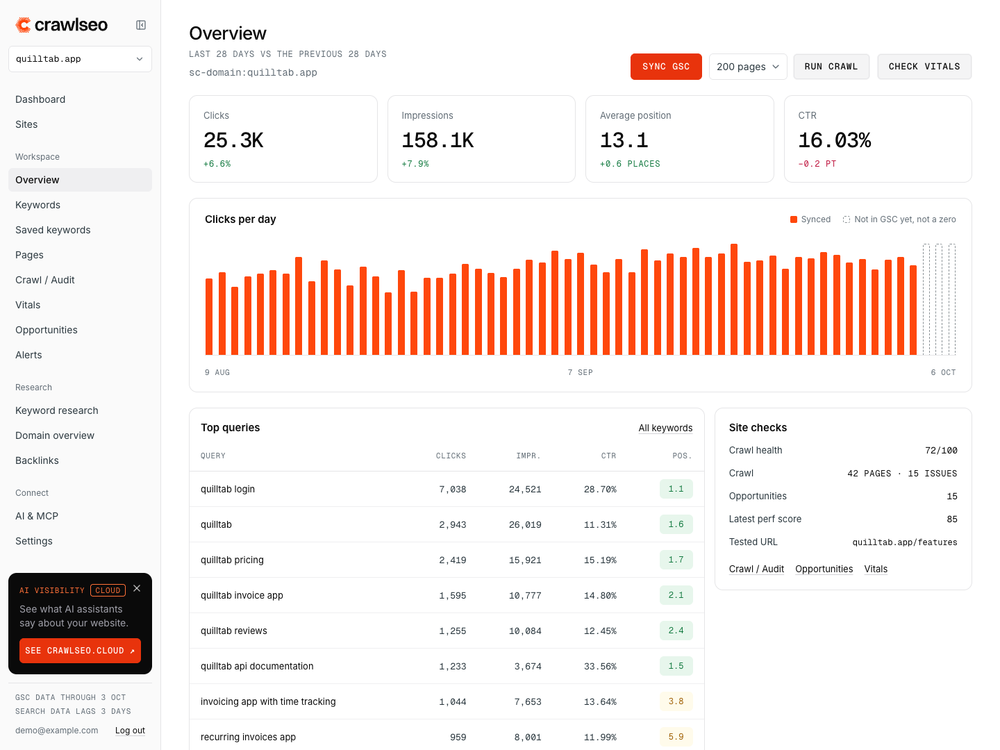
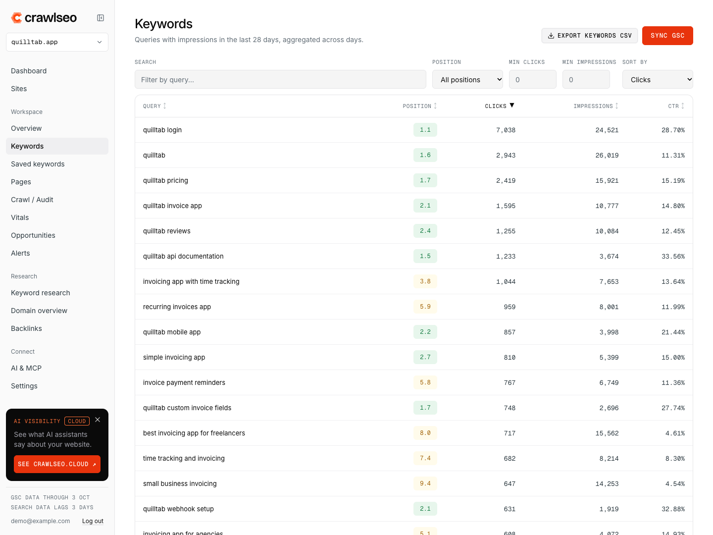
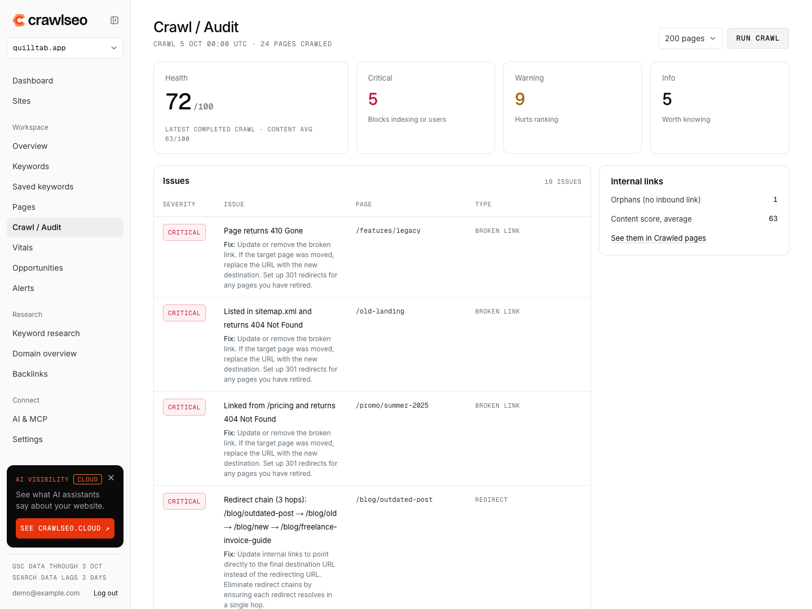
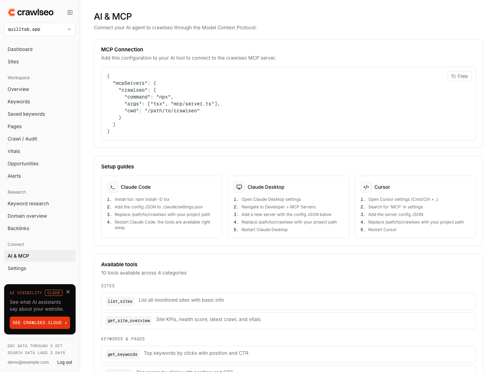

<div align="center">

<h1>
  <picture>
    <source media="(prefers-color-scheme: dark)" srcset="docs/brand/crawlseo-lockup-on-dark.svg" />
    
  </picture>
</h1>

### Open-source SEO monitoring for founders, not SEO specialists

Google Search Console, a site crawler, Core Web Vitals and an MCP server in one self-hosted dashboard. Free forever.

[](https://github.com/crawlseo/crawlseo/stargazers)
[](LICENSE)
[](CONTRIBUTING.md)
[](docker-compose.yml)

</div>

---

<p align="center">
  
</p>

## Why crawlseo?

| | crawlseo | OpenSEO | Ahrefs | Semrush | Moz |
|---|:---:|:---:|:---:|:---:|:---:|
| **Price** | **Free** | $10/mo | €119/mo | $139/mo | $49/mo |
| **Self-hosted** | ✅ | ✅ | ❌ | ❌ | ❌ |
| **GSC integration** | ✅ | ✅ | ✅ | ✅ | ✅ |
| **Site crawler** | ✅ (2000 pages) | ✅ | ✅ | ✅ | ✅ |
| **Core Web Vitals** | ✅ | ❌ | ❌ | ✅ | ❌ |
| **MCP Server** | ✅ (10 tools) | ✅ (24 tools) | ❌ | ❌ | ❌ |
| **AI agent ready** | ✅ | ✅ | ❌ | ❌ | ❌ |
| **Keyword Research** | ✅ (BYOK) | ✅ | ✅ | ✅ | ✅ |
| **Backlinks** | ✅ (BYOK) | ✅ | ✅ | ✅ | ✅ |
| **Open source** | ✅ MIT | ✅ | ❌ | ❌ | ❌ |
| **Your data stays yours** | ✅ | ✅ | ❌ | ❌ | ❌ |

> **BYOK** = Bring Your Own Key. Keyword research and backlink data use DataForSEO (optional). Google Autocomplete suggestions work as a free fallback.

## Features

### 🔍 GSC Analytics

Keywords, pages, clicks, impressions, position tracking with 28-day comparison and delta indicators.

<p align="center">
  
  <br />
  <em>Top keywords with position badges, clicks, impressions, and CTR</em>
</p>

### 🕷️ Site Crawler

Crawl up to 2,000 pages with concurrent fetching. Health score, 16 issue types, content scoring, and remediation guidance.

<p align="center">
  
  <br />
  <em>Crawl results with health score, issue breakdown, and per-page audit data</em>
</p>

### 🤖 MCP server: AI agent integration

10 tools for Claude Code, Claude Desktop, and Cursor. Query your SEO data, run crawls, and find opportunities without leaving the terminal.

<p align="center">
  
  <br />
  <em>MCP setup page with connection config, setup guides, and available tools</em>
</p>

### More features

| | Feature | Description |
|---|---|---|
| ⚡ | **Core Web Vitals** | LCP, CLS, INP, TTFB via PageSpeed Insights with mobile/desktop comparison |
| 🔑 | **Keyword Research** | DataForSEO-powered keyword ideas with volume, difficulty, CPC. Free Google Autocomplete fallback |
| 🔗 | **Backlinks** | Backlink profile, referring domains, anchor text, dofollow/nofollow analysis |
| 📊 | **Rank Tracking** | Historical position snapshots with saved keywords and notes |
| 💡 | **SEO Opportunities** | Striking distance keywords, low CTR, content decay, cannibalization detection |
| 🔔 | **Alerts** | Traffic drops, position changes, new 404s, vitals degradation, by email, Slack, Telegram or webhook |
| 📥 | **CSV Export** | Export keywords and pages data for offline analysis |

## Quick Start

```bash
git clone https://github.com/crawlseo/crawlseo.git
cd crawlseo
cp .env.example .env.local
# Add your Google OAuth credentials to .env.local
docker compose up -d db
npm install
npx prisma migrate dev --name init
npm run dev
```

Open [http://localhost:3000](http://localhost:3000), sign in with Google, and add your first site.

<details>
<summary>🔑 Getting Google OAuth credentials</summary>

1. Go to [Google Cloud Console](https://console.cloud.google.com/)
2. Create a project (or select existing)
3. Enable the **Google Search Console API**
4. Go to **Credentials** → **Create Credentials** → **OAuth 2.0 Client ID**
5. Application type: **Web application**
6. Authorized redirect URI: `http://localhost:3000/api/auth/callback/google`
7. Copy Client ID and Client Secret to `.env.local`

Required scopes: `openid`, `email`, `profile`, `https://www.googleapis.com/auth/webmasters.readonly`

</details>

## MCP server: AI agent integration

crawlseo includes a Model Context Protocol server so AI agents can query your SEO data directly.

Add to your Claude Code settings (`.claude/settings.json`):

```json
{
  "mcpServers": {
    "crawlseo": {
      "command": "npx",
      "args": ["tsx", "mcp/server.ts"],
      "cwd": "/path/to/crawlseo"
    }
  }
}
```

**10 tools available:**

| Category | Tools |
|---|---|
| **Sites** | `list_sites`, `get_site_overview` |
| **Keywords & Pages** | `get_keywords`, `get_pages`, `get_traffic` |
| **Crawl & Audit** | `run_crawl`, `get_crawl_status`, `get_crawl_issues` |
| **Performance** | `get_vitals`, `get_opportunities` |

Works with Claude Code, Claude Desktop, and Cursor. See [`mcp/README.md`](mcp/README.md) for full setup guide.

## Tech Stack

| Layer | Technology |
|---|---|
| **Framework** | [Next.js 16](https://nextjs.org/) (App Router) |
| **Language** | [TypeScript](https://www.typescriptlang.org/) |
| **Database** | [PostgreSQL](https://www.postgresql.org/) |
| **ORM** | [Prisma](https://www.prisma.io/) |
| **Auth** | [NextAuth.js v5](https://authjs.dev/) |
| **UI** | [shadcn/ui](https://ui.shadcn.com/) + [Tailwind CSS v4](https://tailwindcss.com/) |
| **Charts** | Plain React + Tailwind (no chart library) |
| **Icons** | [Lucide React](https://lucide.dev/) |
| **MCP** | [@modelcontextprotocol/sdk](https://modelcontextprotocol.io/) |
| **Deployment** | Docker Compose |

## Self-Hosting

### Docker Compose (recommended)

```bash
git clone https://github.com/crawlseo/crawlseo.git
cd crawlseo
cp .env.example .env
# Edit .env with your credentials
docker compose pull
docker compose up -d
```

Compose pulls the prebuilt `ghcr.io/crawlseo/crawlseo:latest` image, so deployment
credentials are only needed at runtime. Images support `linux/amd64` and
`linux/arm64`, and database migrations run automatically when the container
starts.

Image tags:

| Tag | What it is |
|---|---|
| `latest` | The latest release. Moves only when a version is tagged. |
| `0.2.0`, `0.2` | A release, and the newest patch of a minor version. |
| `edge` | The latest build of `main`, ahead of the last release. |
| `sha-<commit>` | One exact build, for main pushes and releases. |

To pin a release, follow `main`, or use an image from a fork, set
`CRAWLSEO_IMAGE` in `.env`:

```bash
CRAWLSEO_IMAGE=ghcr.io/crawlseo/crawlseo:0.2.0
```

To build locally instead, build the same image name before starting Compose:

```bash
docker build -t crawlseo:local .
CRAWLSEO_IMAGE=crawlseo:local docker compose up -d
```

### Manual

```bash
# Prerequisites: Node.js 20+, PostgreSQL

npm install
cp .env.example .env.local
# Configure .env.local

npx prisma migrate deploy
npm run build
npm start
```

## Environment Variables

| Variable | Required | Description |
|---|---|---|
| `DATABASE_URL` | Yes | PostgreSQL connection string |
| `NEXTAUTH_SECRET` | Yes | Session encryption key (`openssl rand -hex 32`) |
| `GOOGLE_CLIENT_ID` | Yes | Google OAuth client ID |
| `GOOGLE_CLIENT_SECRET` | Yes | Google OAuth client secret |
| `NEXTAUTH_URL` | No | Base URL (auto-detected in most environments) |
| `CRAWLSEO_HIDE_CLOUD_PROMO` | No | Set to `true` to remove the crawlseo.cloud card from the sidebar |

### The crawlseo.cloud card

The sidebar shows one card about [crawlseo.cloud](https://crawlseo.cloud), the hosted AI visibility product from the same team. It is a plain link to the crawlseo.cloud home page (with `utm_source=oss` in the URL): the app makes no request for it, loads no image and sends no analytics. Each user can hide it with the × button (remembered in that browser), and `CRAWLSEO_HIDE_CLOUD_PROMO=true` removes it for everyone on the instance.

## Contributing

Contributions are welcome! See [CONTRIBUTING.md](CONTRIBUTING.md) for guidelines.

```bash
# Fork the repo, then:
git checkout -b feature/your-feature
# Make your changes
git commit -m "feat: add your feature"
git push origin feature/your-feature
# Open a Pull Request
```

## License

MIT License. See [LICENSE](LICENSE) for details.

---

<div align="center">

Built by [Brandson Digital](https://brandson.digital) · Created by [Mike](https://m1ke.digital)

Self-hosted SEO tools should be free. Your data should be yours.

</div>
